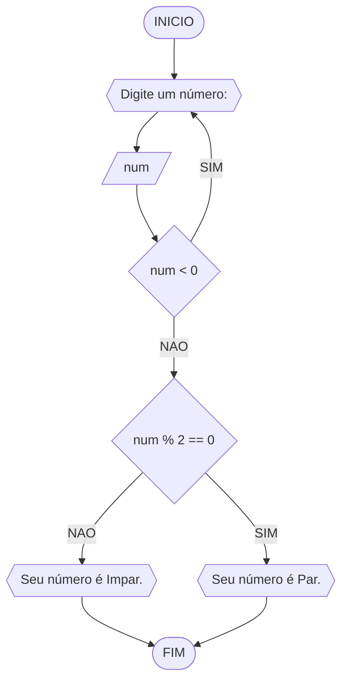
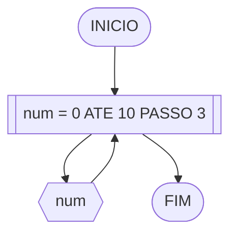
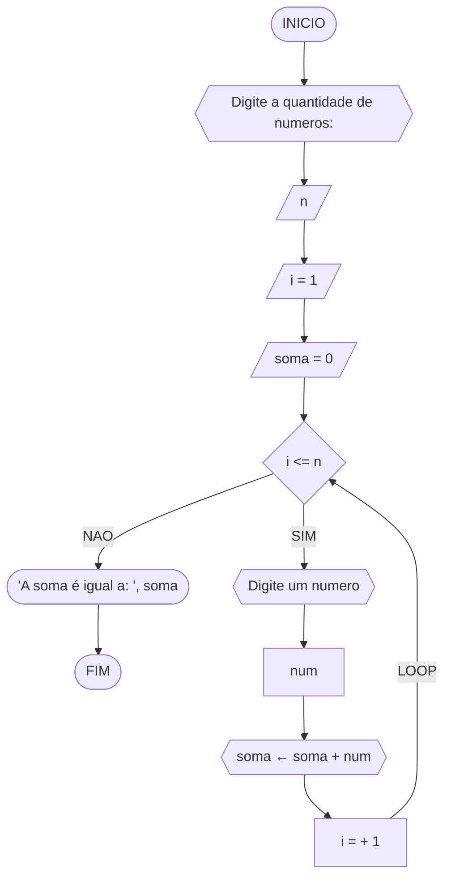
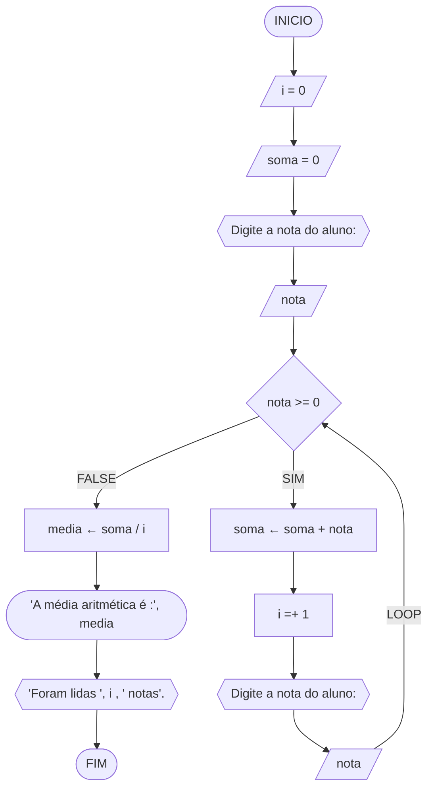

# UNIFOR
**Disciplina:** Raciocínio Lógico

**Orientador:** Professor. Ricardo Carrubi

**Aluno:** Nelkson Guilherme
## Lista de exercícios
### Exercício 1
Atualize o algoritmo para determinar se um número inteiro e positivo é par ou ímpar, usando uma laço condicional para aceitar apenas números maiores ou iguais a zero.
#### Fluxograma

#### Pseudocódigo
```
ALGORITMO_Impar_Par
DECLARE num: Int
INICIO
ESCREVA "Digite um número: ”
LEIA num
ENQUANTO num < 0
	ESCREVA "Digite um número positivo!"
	LEIA num
FIM_ENQUANTO
SE num % 2 == 0
	ENTAO ESCREVA "Seu número é Par."
SENAO
	ESCREVA "Seu número é Impar."
FIM_ALGORITMO
```
| num | SE num < 0| SE num % 2 == 0| SAÍDA | 
|----------|----------|----------|----------|
| 10  |  F  | V  | Seu número é Par.
| 11  | F  |  F |   Seu número é Impar.
| -1  |  V  |   | Digite um número positivo!
### Exercício 2
Faça um algoritmo que exiba na tela uma contagem de 0 até 30, exibindo apenas os múltiplos de 3.
#### Fluxograma

#### Pseudocódigo
```
ALGORITMO_0
DECLARE num: Int
INICIO
PARA num DE 0 ATE 10 passo 3
	ESCREVA num
FIM_PARA
FIM_ALGORITMO
```
| num | SAÍDA 
|----------|----------
|    0      |      0    |
|    1     |      3    |
|    2     |      6    |
|    3    |      9    |
|    4    |    12      |
|    5   |      15    |
|    6   |     18     |
|    7     |     21     |
|    8      |     24     |
|    9      |    27      |
|    10      |      30     |
### Exercício 3
Dada uma sequência de números inteiros, calcular a sua soma. Por exemplo, para a
sequência {12, 17, 4, -6, 8, 0}, o seu programa deve escrever o número 35.
#### Fluxograma

#### Pseudocódigo
```
Algoritmo_00
DECLARE n, i, soma, num: Int
ESCREVA "digite a quantidade de numeros"
LEIA n
i = 1
soma = 0
ENQUANTO i <= n FAÇA
	ESCREVA "Digite um numero"
	LEIA num
	soma ← soma + num
	i =+ 1
FIM_ENQUANTO
ESCREVA "A soma é igual a: ", soma
FIM_ALGORITMO
```
| n | i | SE i <= n | num | soma ← soma + num | i = + 1 |SAÍDA |
|----------|----------|----------|----------|----------|----------|----------|
|     5      |     1     |     V     |    10      |     10 ← 0 + 10     |
|     5    |       2   |       V   |      5    |       15 ← 10 + 5   |
|     5     |      3    |      V    |     2     |      17 ← 15 + 2    |
|     5     |      4    |      V    |     3     |      20 ← 17 + 3    |
|     5     |      5    |      V    |     5    |      25 ← 20 + 5    |
|     5     |      6    |      F    |         |          |            | "A soma é igual: 25"

### Exercício 4
Escreva um programa que leia a nota de diversos alunos, até que seja digitada uma nota
negativa. Nesse momento, ele mostra a média aritmética de todas as notas lidas e quantas
notas foram lidas. Ex. Foram lidas 14 notas. A média aritmética é 6.75!

#### Fluxograma


#### Pseudocódigo
```
ALGORITMO_Media
DECLARE nota, media, i, soma: Int
i = 0
soma = 0
ESCREVA "Digite a nota do aluno: "
LEIA nota
ENQUANTO nota >=0 FAÇA
	soma ← soma + nota
	i  =+ 1
	ESCREVA "Digite a nota do aluno:"
	LEIA nota
FIM_ENQUANTO
media ← soma / i
ESCREVA "A média aritmética é :", media
ESCREVA "Foram lidas ", i , " notas"
FIM_ALGORITMO
```
| nota | SE nota >= 0 | soma ← soma + nota | i = + 1 | media ← soma / i  | SAÍDA 1 |SAÍDA 2
|----------|----------|----------|----------|----------|----------|----------|
|     5      |     V     |     5 ← 0 + 5     |    1      |          |
|     2    |       V   |       7 ← 5 + 2   |      2    |         |
|     3     |      V    |      10 ← 7 + 3    |     3     |          |
|     10     |      V    |      20 ← 10 + 10    |     4     |          |
|     8     |      V   |      28 ← 20 + 8    |     5    |         |
|     -1     |      F    |          |         |   5.6 ← 28 / 5       |  "A média aritmética é : 5.6"        | "Foram lidas 5 notas"
